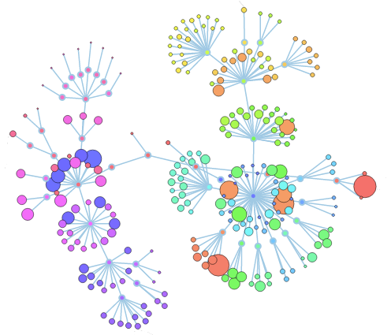
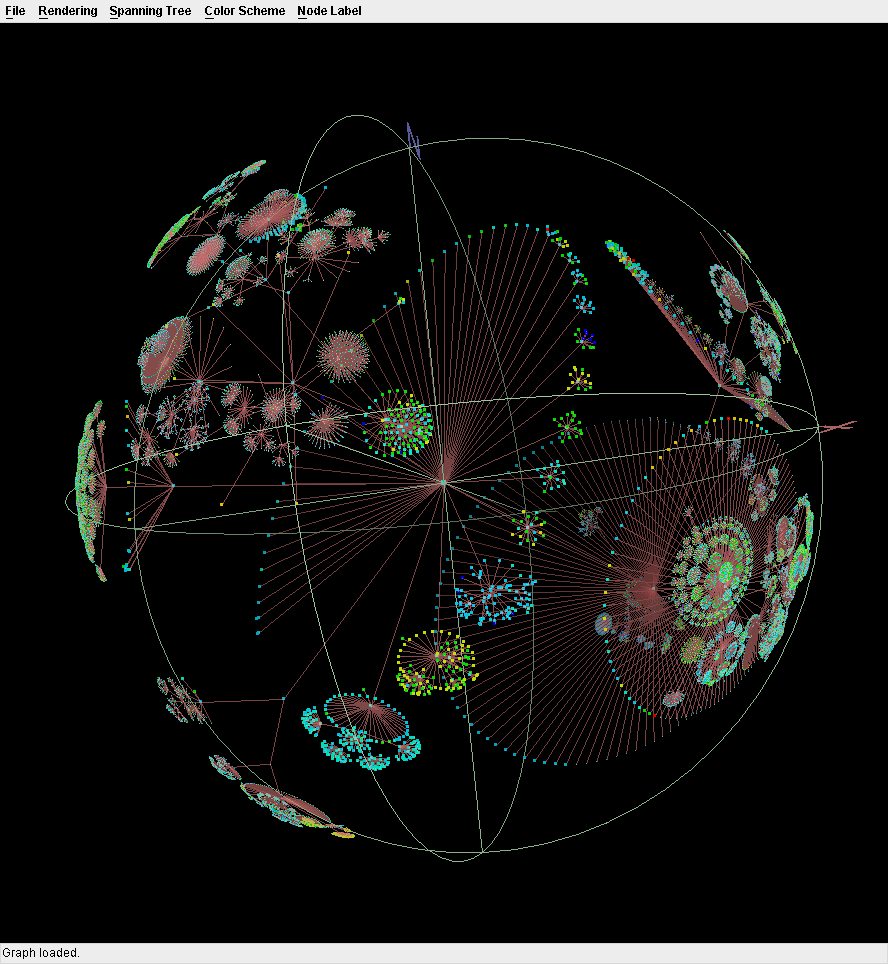

# Visual Research Management
## Motivation
Research / citation managers like [Zotero](https://www.zotero.org/) and [Mendeley](https://www.mendeley.com/) are excellent tools for researchers to manage large amounts of related works in their field. However, to form a **mental map** of a particular topic or sub-field, there is only so much a 2-D list view can do.

 From [zotero.org](zotero.org)

What if we could **visualize** a **network of research papers** in **three dimensions**?

 

From [The D3 Wiki](https://camo.githubusercontent.com/6e489a3d00673a311226e3b0d19561f39c132a2d/687474703a2f2f7265646f7468657765622e636f6d2f696d616765732f636f6465666c6f7765722f636f6465666c6f7765722e706e67)

 

From [caida.org](http://www.caida.org/tools/visualization/walrus/gallery1/lar-gr-l-7.png)
